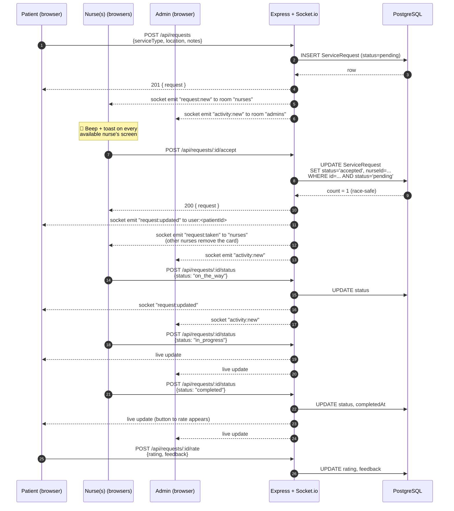

# NurseCare — Application Process Flow

This document walks through how the NurseCare app works end-to-end: every
click, every API call, every database write, and every Socket.io broadcast.

---

## 1. High-level architecture

```
                   ┌────────────────────────────────────┐
                   │            BROWSER (5173)          │
                   │  React + Vite + Tailwind + Leaflet │
                   │                                    │
                   │  ┌──────────┐ ┌──────────┐ ┌──────┐│
                   │  │ Patient  │ │  Nurse   │ │Admin ││
                   │  │ /dashbd  │ │ /nurse   │ │/admin││
                   │  └──────────┘ └──────────┘ └──────┘│
                   └─────────────┬──────────┬───────────┘
                                 │          │
                  HTTPS REST     │          │  WebSocket (Socket.io)
                  (axios + JWT)  │          │  (auth via token)
                                 ▼          ▼
                   ┌────────────────────────────────────┐
                   │       NODE.JS API (5050)           │
                   │  Express  ·  Socket.io  ·  JWT     │
                   │                                    │
                   │  /api/auth      /api/requests      │
                   │  /api/nurses    socket rooms       │
                   └────────────────┬───────────────────┘
                                    │ Prisma Client
                                    ▼
                   ┌────────────────────────────────────┐
                   │         PostgreSQL                 │
                   │  Tables: User, ServiceRequest      │
                   │  Indexes: role, status, lng+lat    │
                   └────────────────────────────────────┘
```

### Three trust boundaries

| Layer    | Trust on |
| -------- | -------- |
| Browser  | JWT in `localStorage` proves who you are |
| API      | Verifies JWT on every REST call, every socket connection |
| Database | Only the API ever talks to it; clients never connect directly |

---

## 2. The three roles

| Role              | Lives at        | Created via                              | Can do |
| ----------------- | --------------- | ---------------------------------------- | ------ |
| `user` (patient)  | `/dashboard`    | self-register on `/register`             | Book home care, track status, cancel, rate |
| `nurse` (or doctor) | `/nurse`      | self-register on `/register` (Nurse tab) | Receive incoming calls, accept, advance status, toggle availability |
| `admin` (Alchemy) | `/admin`        | seed script only — never via public API  | Watch all activity, see live map, manage users |

> **Security note:** Even if a user POSTs `{role: "admin"}` to `/api/auth/register`,
> the controller silently downgrades them to `user`. Admins can only be created by
> running `npm run seed` on the server.

---

## 3. Authentication flow

### 3.1 Sign-up / sign-in

```
Browser                            API                       Postgres
  │                                 │                            │
  │── POST /api/auth/register ─────▶│                            │
  │   { name, email, password,      │── prisma.user.create ─────▶│
  │     role: "user" | "nurse" }    │     (bcrypt hashed)        │
  │                                 │◀──── User row ─────────────│
  │◀──── { token, user } ───────────│                            │
  │                                 │                            │
  │  localStorage:                  │                            │
  │   nc_token = "<JWT>"            │                            │
  │   nc_user  = { ... }            │                            │
  │                                 │                            │
  │── connect socket.io ───────────▶│  io.use(socketAuth)        │
  │   { auth: { token } }           │  jwt.verify → user         │
  │                                 │  socket.join("user:<id>")  │
  │                                 │  socket.join("nurses")     │ (if nurse)
  │                                 │  socket.join("admins")     │ (if admin)
```

**JWT lifecycle** — token contains only the user id, signed with `JWT_SECRET`,
expires in 7 days. Every REST request adds `Authorization: Bearer <token>` via
the axios interceptor in `frontend/src/lib/api.js`. The `protect` middleware
verifies it and loads the latest user from Postgres on every call.

### 3.2 Role-based routing

After login, `Login.jsx` redirects based on `user.role`:

| Role    | Redirect to   |
| ------- | ------------- |
| `user`  | `/dashboard`  |
| `nurse` | `/nurse`      |
| `admin` | `/admin`      |

The `<Protected role="...">` component wraps each route — it bounces
unauthenticated users to `/login` and wrong-role users to their own
dashboard, so a patient can never see `/admin`.

---

## 4. Booking flow (the heart of the app)

This is the full lifecycle from "patient drops a pin" to "nurse marks complete".

### 4.1 Sequence diagram



### 4.2 The status state machine

```
                  ┌────────────┐
                  │   PENDING  │ ← created by patient
                  └─────┬──────┘
                        │ nurse accepts
                        ▼
   ┌─────────────┐  ┌────────────┐  ┌────────────┐  ┌────────────┐
   │  CANCELLED  │◀─│  ACCEPTED  │─▶│ ON_THE_WAY │─▶│IN_PROGRESS │
   └─────────────┘  └────────────┘  └────────────┘  └─────┬──────┘
        ▲ patient cancel                                  │ nurse done
        │ (any non-final state)                           ▼
        │                                          ┌────────────┐
        └──────────────────────────────────────────│ COMPLETED  │
                                                   └─────┬──────┘
                                                         │ patient rates
                                                         ▼
                                                  (rating + feedback)
```

Final states: `completed`, `cancelled`. Once there, no more updates allowed.

### 4.3 Code map for booking

| Step                    | Frontend file                               | Backend file                                              |
| ----------------------- | ------------------------------------------- | --------------------------------------------------------- |
| Pick service + drop pin | `frontend/src/pages/UserDashboard.jsx`      | —                                                         |
| Submit request          | `submit()` → `api.post('/requests', …)`     | `controllers/requestController.js → createRequest`        |
| Real-time fan-out       | —                                           | `io.to('nurses').emit('request:new')`                     |
| Nurse sees + beeps      | `pages/NurseDashboard.jsx → onNew(req)`     | —                                                         |
| Accept                  | `accept()` → `api.post('.../accept')`       | `requestController.js → acceptRequest` (race-safe update) |
| Patient sees update     | `UserDashboard.jsx → onUpdate(req)`         | `io.to('user:<id>').emit('request:updated')`              |
| Nurse advances status   | `updateStatus()` → `api.post('.../status')` | `requestController.js → updateStatus`                     |
| Cancel                  | `cancelReq()`                               | `requestController.js → cancelRequest`                    |
| Rate                    | (extension point on completed cards)        | `requestController.js → rateRequest`                      |

### 4.4 Race-safety on `accept`

When two nurses tap *Accept* at the same instant, only one wins.
The trick is one atomic SQL statement:

```sql
UPDATE "ServiceRequest"
SET status='accepted', "nurseId"=$me, "acceptedAt"=now()
WHERE id=$rid AND status='pending';
```

In Prisma:

```js
const result = await prisma.serviceRequest.updateMany({
  where: { id: req.params.id, status: 'pending' },
  data:  { status: 'accepted', nurseId: req.user.id, acceptedAt: new Date() },
});
if (result.count === 0) return res.status(400).json({ message: 'no longer available' });
```

If `count === 0`, someone else got there first. We respond with an error and
`request:taken` is broadcast to remove the card from everyone else's queue.

---

## 5. Real-time messaging (Socket.io)

### 5.1 Rooms used

| Room name            | Joined by                | Purpose |
| -------------------- | ------------------------ | ------- |
| `user:<userId>`      | every connected user     | Targeted updates to one specific person (e.g. *your* request changed) |
| `nurses`             | every connected nurse    | Broadcast all incoming requests + cancellations |
| `admins`             | every connected admin    | Activity feed for the Alchemy control center |
| `request:<requestId>`| participants of a job    | Live tracking channel (nurse location, etc.) — joined via `request:join` |

### 5.2 Events

| Event             | Direction          | Payload                            | Triggered by             |
| ----------------- | ------------------ | ---------------------------------- | ------------------------ |
| `request:new`     | server → `nurses`  | full request object                | Patient creates a request |
| `request:taken`   | server → `nurses`  | `{ id }`                           | A nurse accepts          |
| `request:updated` | server → `user:<id>` | full request object              | Any status change        |
| `activity:new`    | server → `admins`  | `{ type, request }`                | Any state-changing event |
| `request:join`    | client → server    | `requestId`                        | After create/accept      |
| `nurse:location`  | client → server    | `{ requestId, coordinates }`       | Periodic GPS pings (nurse app) |

### 5.3 Why both REST and Socket.io?

- **REST** = **commands** (create, accept, update, cancel) — easy to retry,
  debuggable, idempotent on most endpoints.
- **Socket.io** = **notifications** (someone else did something that affects
  you) — push, low-latency, no polling.

Each REST controller does its DB write **then** emits the appropriate socket
event(s). The Socket.io server is attached to the same HTTP server and shares
the JWT auth (see `backend/src/socket.js`).

---

## 6. Geo / "nurses near me"

The patient's dashboard calls:

```
GET /api/nurses?lng=77.59&lat=12.97&maxKm=25
```

Inside `nurseController.js → listNurses`:

1. Compute a **bounding box** around the point (cheap, uses indexed `lng`/`lat`).
2. `prisma.user.findMany({ where: { role: 'nurse', available: true, lng: { gte, lte }, lat: { gte, lte } } })`
3. Refine with **Haversine distance** in JS (drops corner outliers).
4. Sort by true distance, return top 50 with a `distanceKm` field.

```
                ┌───────┐
                │ pin   │  ← patient
                └───┬───┘
                    │
       ┌────────────┼────────────┐  bounding box (SQL WHERE)
       │  □         ●            │
       │     ●       ●         □ │  ● = candidate inside box
       │            ┃ ◀──┐      ●│  ┃ = haversine refinement
       │  ●         ●    └─┐     │  □ = dropped (outside true radius)
       │            ●      ●     │
       └─────────────────────────┘
```

For production scale you'd swap this for **PostGIS** + `ST_DWithin` on a
`geography(Point, 4326)` column. The frontend contract doesn't change.

---

## 7. Database schema (Prisma)

```
┌────────────────────────────────────────┐         ┌─────────────────────────────────────┐
│                User                    │ 1     N │            ServiceRequest          │
├────────────────────────────────────────┤◀────────┤─────────────────────────────────────┤
│ id            cuid pk                  │  user   │ id           cuid pk                │
│ name          string                   │         │ userId       fk → User              │
│ email         string @unique           │         │ nurseId      fk → User (nullable)   │
│ phone         string?                  │         │                                     │
│ password      string  (bcrypt)         │ 1     N │ serviceType  enum ServiceType       │
│ role          enum Role                │◀────────┤ notes        string?                │
│                                        │  nurse  │                                     │
│ specialization string?                 │         │ lng, lat     float (location)       │
│ licenseNumber  string?                 │         │ address      string?                │
│ available     bool                     │         │                                     │
│ rating        float                    │         │ status       enum RequestStatus     │
│                                        │         │ acceptedAt   datetime?              │
│ lng, lat      float (location)         │         │ completedAt  datetime?              │
│ address       string?                  │         │ cancelledAt  datetime?              │
│                                        │         │                                     │
│ createdAt, updatedAt                   │         │ rating       int?                   │
└────────────────────────────────────────┘         │ feedback     string?                │
                                                   │                                     │
                                                   │ createdAt, updatedAt                │
                                                   └─────────────────────────────────────┘

Indexes:
  User           (role)        (role, available)        — fast nurse search
  ServiceRequest (status)      (userId)      (nurseId)  — fast feed queries
```

### Why store `lng`/`lat` as plain floats?

- Works on vanilla Postgres — no extensions needed.
- Bounding-box queries are trivially indexable.
- Haversine refinement in JS handles the "true distance" part.

If you later install **PostGIS**, swap to `Unsupported("geography(Point, 4326)")`
and switch queries to `ST_DWithin`.

---

## 8. End-to-end demo script

Once everything is running (backend on `:5050`, frontend on `:5173`):

1. **Open three browser windows side by side.**
2. **Window A — Admin.**
   - Go to `http://localhost:5173/login` → choose "Alchemy Admin"
   - Login: `admin@alchemy.com` / `admin123`
   - You're at `/admin` — empty activity feed, map shows seeded users.
3. **Window B — Nurse.**
   - `http://localhost:5173/login` → "Nurse / Doctor"
   - Login: `priya@nurse.com` / `nurse123`
   - You're at `/nurse` — incoming calls list is empty, you're "Available".
4. **Window C — Patient.**
   - `http://localhost:5173/login` → "Patient"
   - Login: `user@demo.com` / `user1234`
   - At `/dashboard`, click somewhere on the map to move your pin.
   - Choose **Nurse visit**, type a note, click **Request care now**.
5. **Watch the magic.**
   - Window B beeps and a yellow "Incoming call" card appears instantly.
   - Window A's activity feed gets a new "request_created" entry; map shows the pin.
   - In B, click **Accept** → the card moves to "My active jobs".
   - In C, the request card flips to "Accepted" and shows the nurse's name + phone.
   - In B, click **On the way** → C and A both update live.
   - Click **Start visit**, then **Complete** → C's card flips to "Completed".
   - A sees every transition stream in.

That's the full lifecycle, in real time, across three browsers.

---

## 9. Where to extend

| Want to add…                | Touch these files |
| --------------------------- | ----------------- |
| Live nurse GPS on map       | `NurseDashboard.jsx` (geolocation watch + `socket.emit('nurse:location')`) and `UserDashboard.jsx` (listen for `nurse:location` in joined `request:<id>` room) |
| Payments                    | New `payments` controller + Stripe SDK + `Payment` model in `schema.prisma` |
| Push notifications          | Firebase Cloud Messaging tokens stored on `User`, sent server-side on `request:new` |
| Multi-city dispatch rules   | Extend `nurseController.listNurses` with city/zone filtering |
| Background checks for nurses | Add `verified: Boolean @default(false)` to `User` and an admin approval endpoint |
| Migrations (instead of `db push`) | `npx prisma migrate dev --name init` |

---

## 10. TL;DR

- **Patient** drops a pin → REST `POST /api/requests` writes Postgres → Socket.io fans out to **all nurses** instantly.
- **First nurse** to accept wins (atomic SQL). Patient gets live `request:updated`. Other nurses get `request:taken`.
- **Status updates** (`on_the_way` → `in_progress` → `completed`) flow through the same channel.
- **Alchemy admin** is subscribed to a global `admins` room and sees everything live on a map.
- All of it persists in **PostgreSQL** via Prisma — you can open `npm run db:studio` at any time to inspect rows.

That's NurseCare in one page.
